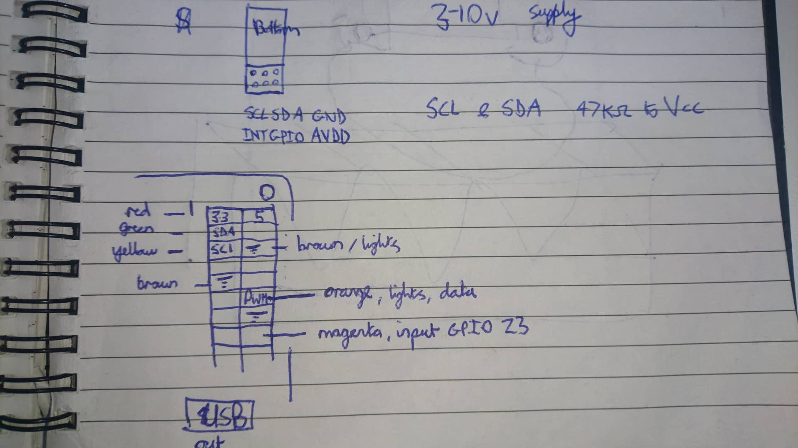

# Brimm
Brimm is an art project designed around rubbish.

The idea is to provide an experience that encourages correct rubbish disposal. To provide a 'carrot' of sorts rather than lecturing people. The carrot in this case will be an reactive interactive experience that excites people to correctly dispose of rubbish. The end format will be an art car :D

## Part 1 - A rubbish bin
We'll convert a rubbish bin into a friendly monster that talks, lights up (and hopefully) belches fire in response to human interactions. The monster will be surprising and fun to interact with. 

*Concept sketch*

BOM
https://docs.google.com/spreadsheets/d/1yVDrTSlCtS1k4X6xUT0yPUyhm17ppG_9IsI53mKKvTw/edit?usp=sharing

### Base electrical
The basis of this system is a battery powered raspberry pi. We also need to power the lights, motor, and put a kill switch to save power. It would also be nice if the system was self contained, this means having a charger externally available. 

To achieve the power demands we need a step down converter with a high ampage supply to power the light strip. 

### Lighting

### Trigger
For the mouth trigger we will use a simple range sensor to detect when the bin lid opens and closes. This is a proxy for someone putting rubbish in. This will allow us to be reactive to interaction. Eventually it would be nice to use a camera to do this directly rather than depending on heuristics.

The range sensor we will use is the VL6180X sattalite board. Coincediently this board is also produced by adafruit, so there's plently of useage examples floating around.

https://www.st.com/en/evaluation-tools/vl6180x-satel.html#design-scroll

#### Testing wiring and setup

*gpio wiring*

To use the range sensor, we first need to enable i2c: 

``sudo rasp-config``

Then, enable the gpio line to the sensor, if it is on pin 23: 

``echo "23" > /sys/class/gpio/export``

``echo "out" > /sys/class/gpio/gpio23/direction ``

``echo "1" > /sys/class/gpio/gpio23/value ``

This should mean that the sensor appears at address 0x29 when running

``i2cdetect -y 1``

### Mouth

Record sounds
