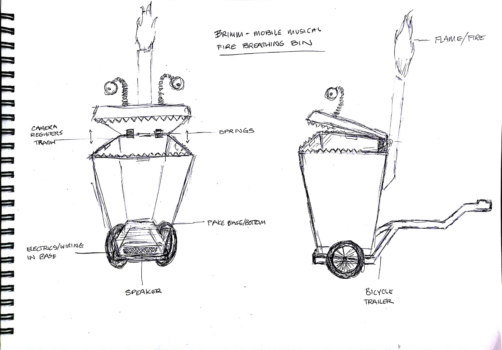

# Brimm
Brimm is an art project designed around rubbish.

The idea is to provide an experience that encourages correct rubbish disposal. To provide a 'carrot' of sorts rather than lecturing people. The carrot in this case will be an reactive interactive experience that excites people to correctly dispose of rubbish. The end format will be an art car :D

## Part 1 - A rubbish bin
We'll convert a rubbish bin into a friendly monster that talks, lights up (and hopefully) belches fire in response to human interactions. The monster will be surprising and fun to interact with. 

*Concept sketch*

BOM
https://docs.google.com/spreadsheets/d/1yVDrTSlCtS1k4X6xUT0yPUyhm17ppG_9IsI53mKKvTw/edit?usp=sharing

### Base electrical
The basis of this system is a battery powered raspberry pi. We also need to power the lights, motor, and put a kill switch to save power. It would also be nice if the system was self contained, this means having a charger externally available. 

To achieve the power demands we need a step down converter with a high ampage supply to power the light strip. 

### Lighting

### Trigger

### Mouth
